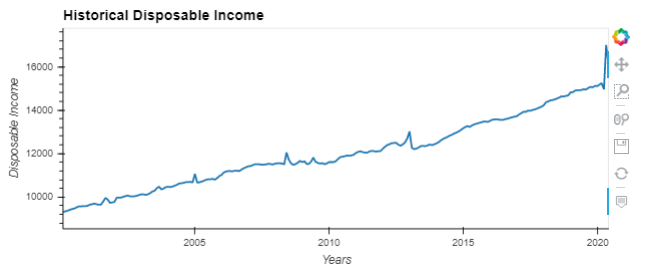

# **FinTech Credit Card Risk Analysis:** 

## June 29, 2020
## Aaron Packard, Mark Foxworth, Alex Waters
---

## Summary: 
The subject analysis serves as a review of the existing credit card market envionrment in terms of credit card originations, charge offs, and delinquencies.  The model included within this review uses the correlation between unemployment rate and credit card charge offs to (1) forecast expected unemployment rates over the subsequent 12 month period, (2) estimate future credit card charge offs based on forcasted unemployment rate via linear regression, and (3) make a lending recommendation based on a financial institutions acceptable risk tolerance (acceptable charge off rate). 

---

## Data Sources:

     

 - ## CFPB:
    - Credit Card Origination Data was extrapalated from the Consumer Financial Protestion Bureau various orignation reports available in CSV format.
    - Available information includes card origintation volume by age group, income level, and credit score. 

- ## Quandl:
    - The Quandl API was used to pull various economic data progvided by the Federal Reserve. 
    - Available information used includes unemployment rates, personal savings rates, disposable income, credit card charge off levels, and credit card delinquency rates. 

---

## Packages Used: 

 - Pandas, PyViz, Plotly Express, Pathlib, dotenv, Quandle-API, Hvplot, SkLearn, Panel
---
## Questions Explored in the Analysis:

1. What is the relationship between age, neighborhood income level, and credit scores compared to credit card origination volume?  

    *This question was explored using available information from the CFPB.*

**Lending by Age Group ($)**

- Age origination data reveals that the majority of credit card originations are with age groups betwen ages 30 - 64.  

- Younger demographics represent the lowest concentration in card orignations by dollar volume.  This is assumed to be related to the lack of established credit associated with this demographic. 

- The over 65 demographic shows an interesting case as originations are low. This may be attributed to a generational view of the use of cards.  

**Lending by Average Neighborhood Income Level ($)**

- Majority of origination volume is associated with higher and middle income levels.  

**Credit Score Group ($)**

- Credit score information reveals a significant concentration in card originations with super prime borrowers.  
 - Given credit score is highly weighted credit qualification criteria, it is expected the origination volume in subprime and deep supbrime buckets will be low.

### Overall Findings:
- There is a significant concentration in credit card origination volume with high income and credit tier levels in the information provided.  
- The areas of highest origination volume are expected given financial institutions seek to migigate risk by lending to higher income and credit score levels in general.  
- Age demographic information reveals two underserved demographics in ages under 30 and over 65.  The under 30 demographic may be attributed to the lack of qualifying information such as established credit history and income.  The over 65 bucket presents an interesting case which could be explored further.  

---
2. What is the relationship between prime rate, personal savings rate, and unemployment rate to credit card delinquency rates and credit card charge off rates? 

    *This question was explored using the available information from the FED via the Quandl API.*

*Historical Disposable Income ($)*

- Disposable income has been trending up over the course of the sample period.

*Historical Rates Data*

- Note the significant increase in unemployment rate and personal savings at the end of May 2020.  

*Historical Credit Card Charge off and Deliquency, Prime Rate with Red Line Unemployment Indicator*

- Card delinquency and charge off track closely with one another.
- Note unemployment follows closely with these variables as well.  

*Correlation Calculations*

### Overall Findings:

- All datapoints were merged into a master dataframe to calculate the correlation among variables. 
- Data was cleaned to compare monthly data and quarterly data via the resample function. 
- Variables with the highest correlation relative to credit card charge offs were credit card delinquencies (0.80 coeff.) and unemployment rate (0.65 coeff.) 
-A future increase in unemployment seems to indicate there will be an adverse impact to credit card charge offs and delinquencies based on the correlation coefficients.
- Given the correlations between charge off and unemployment rate and the high frequency of reporting (unemployment rate is monthly whole delinquency is quarterly), unemployment rate was chosen for the basis of the model.  

---

3. Based on the current economic environment and historical impacts on the credit card market, should an organization adopt measures to increase card originations or should card originations be reduced?
    
    *The question was explored using a linear Regression Analysis measuring unemployment rate and credit card charge offs to find the linear relations between the variables. A Monte Carlo Analysis was completed to estimate the unemployment rate over the next 12 months.*

### Linear Regression Analysis: 
*Distribution Plot Credit Card Charge Off Rate ($)*

*Scattter Plot: Unemployment to Charge Off*

- The distribution information above present a somewhat linear relationship between unemployment and credit card chargeoff.  
- This relationship supports the use of linear regression for the analysis.   

*Actual vs Predicted Charge Off Rate ($)*

- The analysis was completed using machine learning with test and training data (training size 80%, test size 20%)
- Results above show the model is fairly close in its predictions compared to actual results with some variation.  

*Regression Results ($)*

- Best fit line demonstrates the linear relationshp.

### Monte Carlo Analysis:

*Projected Unemployment Rates for Next 12 Months Via 1000 Simulations*

*Simulated Unempolyment for Next 12 Months*

- Monte Carlo Analysis results in a range of unemployment between 6.9% and 24.0% with a 90% confidence interval. 

---
### Recommended Action: 

*Financial Instution Recommendations Based On Risk Tollerance*

- Given an institution's level of risk tolerance which is defined as its acceptable charge off rate, a decision to continue within the credit card lending market or exit can be derived from the model.  

## Post Mortem:

* We recognize that there is a delay when charge off and unemployment occur.  A credit card must be delinquent first before charge off.
* Historical loan data was not analyzied to accurately to determine financial institution risk tolerance
* Geographic locations where not considered(eg. unemployment rates in local regions)
